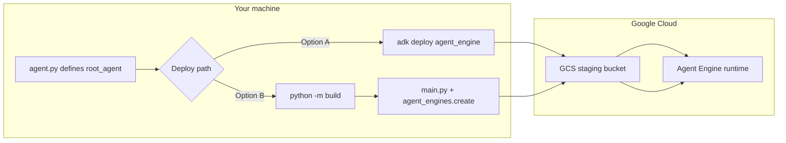

# ADK Research Agent → Vertex AI Agent Engine

Deploy a [Google Agent Development Kit (ADK)](https://google.github.io/adk-docs/) agent to [Vertex AI Agent Engine](https://cloud.google.com/vertex-ai/generative-ai/docs/agent-engine/overview). This example defines a **research assistant** that uses Gemini and the built-in **Google Search** tool.

---

## What’s in this repo

| Piece | Role |
|-------|------|
| `agent_engine/agent/agent.py` | Defines `root_agent` (required name for ADK / Agent Engine) |
| `agent_engine/agent/requirements.txt` | Runtime deps for CLI deploy |
| `agent_engine/deploy_cli.py` | ADK CLI deploy via subprocess (`adk deploy agent_engine`, cwd = agent folder) |
| `agent_engine/main.py` | Programmatic deploy with wheel (`python agent_engine/main.py`) |
| `pyproject.toml` | Builds a wheel so the remote runtime can import your `agent` package |

```text
adk-example/
├── pyproject.toml
├── README.md
└── agent_engine/
    ├── deploy_cli.py           # ADK CLI deploy (recommended)
    ├── main.py                 # wheel + agent_engines.create
    └── agent/
        ├── __init__.py         # exports root_agent
        ├── agent.py            # root_agent definition
        └── requirements.txt
```

After `python -m build`, a wheel is written to:

```text
dist/agent_engine-0.1.0-py3-none-any.whl
```

---

## Prerequisites

### 1. Google Cloud project

1. Create or select a [Google Cloud project](https://console.cloud.google.com/projectcreate).
2. Note your **Project ID** (not the numeric project number).
3. Enable APIs:
   - [Vertex AI API](https://console.cloud.google.com/apis/library/aiplatform.googleapis.com)
   - [Cloud Resource Manager API](https://console.cloud.google.com/apis/api/cloudresourcemanager.googleapis.com)

### 2. Staging bucket

Agent Engine needs a **GCS bucket** for staging artifacts during deploy.

```bash
export PROJECT_ID="your-project-id"
export REGION="your-region"
export STAGING_BUCKET="gs://${PROJECT_ID}-agent-staging"

# Create bucket (pick a globally unique name if needed)
gcloud storage buckets create "${STAGING_BUCKET#gs://}" \
  --project="${PROJECT_ID}" \
  --location="${REGION}"
```

Supported regions: [Agent Engine locations](https://cloud.google.com/vertex-ai/generative-ai/docs/agent-engine/overview).

### 3. Authentication

```bash
gcloud auth login
gcloud auth application-default login
gcloud config set project "${PROJECT_ID}"
```

### 4. Local Python environment

Python **3.10+** recommended.

```bash
cd adk-example
python -m venv .venv
source .venv/bin/activate   # Windows: .venv\Scripts\activate
pip install -U pip
pip install -e ".[dev]" 2>/dev/null || pip install google-adk "google-cloud-aiplatform[adk,agent_engines]>=1.88" build
```

Set `REGION` to a [supported Agent Engine region](https://cloud.google.com/vertex-ai/generative-ai/docs/agent-engine/overview) (placeholder: `your-region`).

Install the ADK CLI if you plan to use **Option A** (recommended for a first deploy):

```bash
pip install google-adk
```

---

## The agent

`root_agent` is a single ADK `Agent` configured for web research:

```python
# agent_engine/agent/agent.py
root_agent = Agent(
    name="researcher",
    model="gemini-flash-latest",
    instruction="You help users research topics thoroughly.",
    tools=[google_search],
)
```

To change behavior, edit `agent.py` and redeploy. For multi-agent setups, orchestrate sub-agents from `root_agent` (see [ADK multi-agent docs](https://google.github.io/adk-docs/)).

---

## Deploy

Both paths publish the same thing: your `root_agent` wrapped in an `AdkApp`, running on **Vertex AI Agent Engine**. Pick the path that matches how much control you need over packaging and dependencies.

| | **Option A — `adk deploy`** | **Option B — wheel + `main.py`** |
|---|---------------------------|----------------------------------|
| **Best for** | First deploy, small agents, standard layout | Custom deps, env vars, CI/CD, multi-module packages |
| **You provide** | Agent folder (`agent_engine/agent/`) | Built `.whl` + `main.py` |
| **Packaging** | CLI bundles source for you | You run `python -m build`; wheel is uploaded via `extra_packages` |
| **Wheel required?** | No | Yes — remote runtime `pip install`s your wheel |
| **Entry point** | `python agent_engine/deploy_cli.py` or `adk deploy` from `agent_engine/agent/` | `python agent_engine/main.py` |



Deploy usually takes **several minutes**. Track status in the [Agent Engine console](https://console.cloud.google.com/vertex-ai/agents/agent-engines) or Cloud Logging.

---

### Option A — `adk deploy agent_engine` (recommended to start)

The ADK CLI is the fastest way to go from this repo to a live Agent Engine. It reads your agent folder, wraps `root_agent` in `AdkApp`, and creates the remote engine — **no wheel build on your side**.

Deploy uses **`.`** as the source path and sets **`cwd`** to the agent package folder (same pattern as `deploy_cli.py` in this repo).

#### What the CLI expects

The command runs **inside** `agent_engine/agent/` (not from `main.py`):

```text
agent_engine/agent/
├── __init__.py       # e.g. from .agent import root_agent
├── agent.py          # must define root_agent
└── requirements.txt  # packages installed in the remote container
```

`requirements.txt` already lists `google-adk` and `google-cloud-aiplatform[adk,agent_engines]`. Add any extra libraries your tools need before deploying.

#### Option A.1 — Python wrapper (this repo)

`agent_engine/deploy_cli.py` runs the CLI via `subprocess` with `cwd=agent_engine/agent` and deploys `.`:

```bash
python agent_engine/deploy_cli.py \
  --project=your-project-id \
  --region=your-region \
  --display-name=Research Agent
```

Equivalent to:

```python
command = [
    "adk",
    "deploy",
    "agent_engine",
    f"--project={project}",
    f"--region={region}",
    f"--display_name={display_name}",
    ".",
]
subprocess.run(command, cwd="agent_engine/agent", check=True)
```

#### Option A.2 — Shell (manual)

From the repository root:

```bash
cd agent_engine/agent

adk deploy agent_engine \
  --project=your-project-id \
  --region=your-region \
  --display_name="Research Agent" \
  .
```

> **Note:** The last argument must be `.` and the process **cwd** must be `agent_engine/agent/`. The ADK CLI has no `--cwd` flag — use `cd` or `deploy_cli.py`.

#### CLI flags used here

| Flag | Format | Purpose |
|------|--------|---------|
| `--project` | `--project=your-project-id` | GCP project ID |
| `--region` | `--region=your-region` | Agent Engine region ([supported regions](https://cloud.google.com/vertex-ai/generative-ai/docs/agent-engine/overview)) |
| `--display_name` | `--display_name=Research Agent` | Name shown in the console |
| source path | `.` | Current directory — must be `agent_engine/agent/` |

Optional flags you can append to the same command if needed: `--staging_bucket=gs://…`, `--trace_to_cloud`, `--env_file=.env`.

#### What happens under the hood

1. CLI validates the agent folder (`__init__.py`, `agent.py` with `root_agent`, `requirements.txt`).
2. Your agent code and dependencies are uploaded and built into the managed Agent Engine runtime.
3. A **Reasoning Engine** resource is created; the CLI prints its **resource name**.

Example output:

```text
AgentEngine created. Resource name:
projects/123456789/locations/your-region/reasoningEngines/751619551677906944
```

#### When Option A is enough

- Single-folder agent (like this example).
- Dependencies fit in `requirements.txt`.
- You do not need to customize `agent_engines.create()` (extra packages, env vars).

#### Redeploy after code changes

Edit `agent.py`, then run `deploy_cli.py` again or repeat the shell command from `agent_engine/agent/`.

---

### Option B — Wheel + `main.py` (programmatic deploy)

Use this path when the CLI is not flexible enough: **multiple Python modules**, shared libraries, pinned dependency sets, or **environment variables** passed into `agent_engines.create()`.

Agent Engine runs your agent in an isolated container. That container must be able to `import` your package. Passing a **wheel** (`.whl`) in `extra_packages` is the reliable pattern: the service runs `pip install` on your wheel so `agent` lands in `site-packages` and imports work the same as locally.

#### Why a wheel?

| Without wheel | With wheel |
|---------------|------------|
| Remote may not see your package layout | `agent` is installed as a proper distribution |
| Risk of `ModuleNotFoundError: agent` | Imports like `from agent.agent import root_agent` match production |
| Fine for flat `adk deploy` folders | Better for `pyproject.toml`, shared code, CI pipelines |

This repo’s `pyproject.toml` packages `agent_engine/agent/` as the **`agent`** distribution named `agent_engine` on PyPI-style metadata (wheel file: `agent_engine-0.1.0-py3-none-any.whl`).

#### Step 1 — Build the wheel

From the **repository root**:

```bash
pip install build
python -m build
```

Confirm the artifact:

```bash
ls dist/
# agent_engine-0.1.0-py3-none-any.whl
```

After changing agent code, bump `version` in `pyproject.toml` (optional but helps avoid stale caches) and rebuild.

#### Step 2 — Run `main.py`

`main.py` does what `adk deploy` does internally, but explicitly:

1. `vertexai.init(project, location, staging_bucket)`
2. `AdkApp(agent=root_agent, enable_tracing=True)`
3. `agent_engines.create(adk_app, requirements=[…], extra_packages=[wheel], env_vars={…})`

**Environment variables:**

```bash
export GOOGLE_CLOUD_PROJECT="your-project-id"
export GOOGLE_CLOUD_LOCATION="your-region"
export STAGING_BUCKET="gs://your-staging-bucket"

# Optional: custom wheel path
# export AGENT_WHL_FILE="/absolute/path/to/agent_engine-0.1.0-py3-none-any.whl"

python agent_engine/main.py
```

**Or CLI flags:**

```bash
python agent_engine/main.py \
  --project=your-project-id \
  --location=your-region \
  --staging-bucket=gs://your-staging-bucket
```

If the wheel is missing, the script fails fast with `Agent wheel file not found` — run Step 1 first.

#### What gets uploaded

| Argument | This repo |
|----------|-----------|
| `requirements` | `google-cloud-aiplatform[adk,agent_engines]>=1.88`, `google-adk`, and the wheel path |
| `extra_packages` | Same `.whl` — installed into the remote environment |
| `env_vars` | `{}` by default; extend `create()` in `main.py` for API keys etc. |

#### When to prefer Option B

- Imports across multiple packages (e.g. `from mylib.tools import …`).
- You deploy from **CI/CD** and want a repeatable `python -m build && python agent_engine/main.py` pipeline.
- You need **custom `requirements`** or **runtime env vars** not exposed by `adk deploy`.

#### Redeploy workflow

```bash
# 1. Edit agent_engine/agent/agent.py (or other packaged modules)
# 2. Rebuild
python -m build
# 3. Deploy again
python agent_engine/main.py
```

---

### Choosing between A and B

```text
Start here ──► deploy_cli.py / adk deploy (Option A)
                    │
                    ├─ deploy works, agent runs ──► stay on A
                    │
                    └─ ModuleNotFoundError / multi-package / CI needs ──►
                           python -m build + main.py (Option B)
```

You can use **Option A for development** and **Option B for production** if that fits your team; both deploy to the same Agent Engine product.

---

## Environment variables

| Variable | Used by | Description |
|----------|---------|-------------|
| `GOOGLE_CLOUD_PROJECT` | `main.py` | GCP project ID |
| `GOOGLE_CLOUD_LOCATION` | `main.py` | Region — set to `your-region` (e.g. a supported Agent Engine region) |
| `STAGING_BUCKET` | `main.py` | GCS URI, e.g. `gs://my-bucket` |
| `AGENT_WHL_FILE` | `main.py` | Path to `.whl` (default: `dist/agent_engine-0.1.0-py3-none-any.whl`) |

---

## Query a deployed agent

After deploy, use the **resource name** from the CLI or script output.

### REST API

```text
https://{LOCATION}-aiplatform.googleapis.com/v1/projects/{PROJECT_ID}/locations/{LOCATION}/reasoningEngines/{RESOURCE_ID}:query
```

See [Use an ADK agent on Agent Engine](https://cloud.google.com/vertex-ai/generative-ai/docs/agent-engine/use/adk) for request bodies and auth.

### Vertex AI SDK (Python)

```python
import vertexai
from vertexai import agent_engines

vertexai.init(project="your-project-id", location="your-region")

remote = agent_engines.get(
    "projects/PROJECT_NUMBER/locations/your-region/reasoningEngines/RESOURCE_ID"
)

# Example: stream a reply (API surface may vary by SDK version)
for event in remote.stream_query(
    user_id="user-1",
    message="What are the latest trends in renewable energy?",
):
    print(event)
```

Refer to the [ADK Agent Engine test guide](https://google.github.io/adk-docs/deploy/agent-engine/test/) for up-to-date query examples.

---

## Customize & redeploy

1. Edit `agent_engine/agent/agent.py` (model, instructions, tools).  
2. Bump `version` in `pyproject.toml` if you use the wheel path.  
3. Redeploy:
   - **Option A:** `python agent_engine/deploy_cli.py --project=… --region=… --display-name=…`
   - **Option B:** `python -m build` then `python agent_engine/main.py`.

---

## Troubleshooting

| Symptom | What to try |
|---------|-------------|
| `Agent wheel file not found` | Run `python -m build` from repo root, or set `AGENT_WHL_FILE` to your `.whl` |
| `ModuleNotFoundError: agent` on remote | Use Option B: `python -m build` and deploy with `main.py`; or use Option A with `deploy_cli.py` (deploys from `agent_engine/agent/`) |
| `adk: command not found` | `pip install google-adk` and ensure your venv is active |
| `adk deploy` fails on region | Use a [supported Agent Engine region](https://cloud.google.com/vertex-ai/generative-ai/docs/agent-engine/overview) for `your-region` |
| Auth / permission errors | `gcloud auth application-default login` and check Vertex AI + Storage roles on the project |
| API not enabled | Enable Vertex AI and Cloud Resource Manager APIs (see Prerequisites) |
| Missing project / bucket | Set `GOOGLE_CLOUD_PROJECT` and `STAGING_BUCKET`, or pass CLI flags to `main.py` |

---

## References

- [ADK documentation](https://google.github.io/adk-docs/)
- [Deploy to Agent Engine (ADK)](https://google.github.io/adk-docs/deploy/agent-engine/deploy/)
- [Agent Engine overview](https://cloud.google.com/vertex-ai/generative-ai/docs/agent-engine/overview)
- [ADK CLI — `adk deploy agent_engine`](https://google.github.io/adk-docs/api-reference/cli/cli.html#adk-deploy-agent-engine)

---

## License

Use and modify this example as needed for your own projects.
